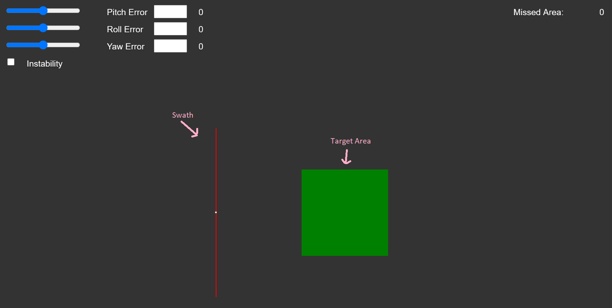

# SatSim

## Simulation to describe [SPOC CubeSat's](http://smallsat.uga.edu/) pointing accuracy

When pointing towards the earth, the payload of the satellite captures a very small portion of the earth's surface at each moment in time, called the swath. The goal of this simulation is to ensure that the swath of the SPOC satellite will capture the entire target area. 

As seen in the picture above, there are errors and instability involved in this calculation, so the swath will not always be pointing exactly where we want it to be. The satellite experiences a 3 sigma instability of .1 degrees/sec, meaning that the swath's error is changing on any axis (pitch, roll, yaw) at a rate of .1 degrees/sec or less 99.7% of the time. The swath will never surpass .5 degrees of inaccuracy on any axis. This translates to \~3.4908 km of error for pitch and yaw, with the rate of change of this error (instability) maxing out at 0.698 km/sec 99.7% of the time. Finally, there is a pointing knowledge of .055 degrees. Pointing knowledge defines the degree of accuracy for which the satellite is pointing where it "thinks" it is pointing.

### Key data points-
- 400 km altitude
- 50 x 50km target area
- 98 km x 130m swath
- .5 degree pointing accuracy
- .055 degree pointing knowledge

## Simulation technical details

### Tech stack-  
[p5.js](https://p5js.org/)
